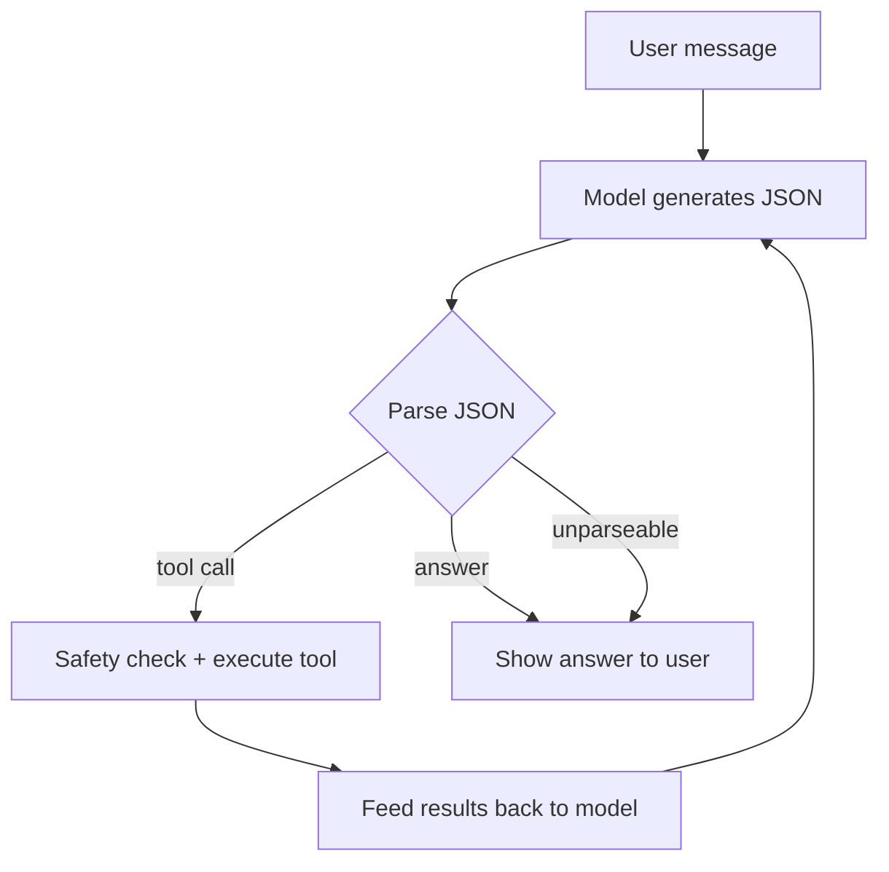

# 🤖 AIDO — AI Desktop Operator (MVP)

**AIDO** is a 100% open-source (MIT), fully local AI assistant for Linux
desktops. It interprets natural-language commands and executes desktop
actions through a lightweight local model — no cloud, no telemetry, no
external APIs.

This repository implements **AIDO-FAST**, the MVP tier designed to run on
resource-constrained systems: **<1GB VRAM or ≤6GB RAM** with a ~700MB model
and sub-second response times.

```
$ aido
🤖 AIDO ready! Type 'exit' to quit.

You: Open Firefox
AIDO: Opening Firefox...

You: What's in my Downloads folder?
AIDO: Here are the contents of ~/Downloads:
  📁 Projects/
  📄 report.pdf (2.4MB)
  📄 image.png (1.1MB)
```

---

## ✨ Core Value Proposition

- **100% Open Source** — MIT licensed, free for commercial use
- **Private & Local** — all inference happens on your machine
- **Resource Efficient** — runs on a 700MB quantized model
- **Custom Distro Ready** — built for Linux desktop environments
- **Developer Friendly** — a small, readable Python codebase that is easy to extend

## 📊 Three-Tier Architecture

Same codebase, just swap the model file (`model.path` in the config).

| Tier | Hardware | Model | Size | Use Case |
|------|----------|-------|------|----------|
| **AIDO-FAST** (this MVP) | <1GB VRAM / ≤6GB RAM | Granite 4.0 H 1B (Q4) | ~700MB | Quick commands, daily automation |
| **AIDO-PRO** | ~6GB RAM/VRAM | Llama 3.2 3B (Q4) | ~2.2GB | Complex multi-step tasks |
| **AIDO-ULTRA** | 8GB+ RAM/VRAM | Qwen 2.5 14B (Q4) | ~8GB | Expert assistant, code analysis |

## 🛠️ Core Capabilities

| Domain | Tools |
|--------|-------|
| **Desktop automation** | `launch_app`, `list_processes`, `terminate_process`, window move/resize/minimize/maximize/focus/close, screen size, `screenshot`, `system_info` |
| **File operations** | `list_files` (with size/type/date metadata), `find_files` (name or glob), `file_info` |
| **Configuration** | `read_config`, `edit_config` (JSON/YAML/INI, dot-notation keys), `backup_config`, `restore_config` |
| **Web interaction** | `fetch_url`, `browse_page` (title + main-text extraction), `download_file` |

Run `aido --list-tools` for the full registry with descriptions.

## 🔧 Technical Stack (100% MIT/Apache-2.0)

| Layer | Component | License |
|-------|-----------|---------|
| Model | IBM Granite 4.0 H 1B (GGUF Q4_K_M, 2048-token context) | Apache-2.0 |
| Inference | llama.cpp via llama-cpp-python (CPU-first, GPU optional) | MIT |
| Agent | Custom tool-calling loop with robust JSON parsing | MIT |
| Window control | wmctrl / xdotool | MIT/GPL |
| Web | Playwright (Chromium), requests | Apache-2.0 |
| Config | PyYAML, stdlib `json`/`configparser` | MIT |

---

## ✨ Phase 2 Preview: Voice, GUI & System Tray

AIDO ships early versions of the Phase 2 interfaces behind optional extras:

```bash
# Voice input (offline transcription via PocketSphinx by default)
pip install -e ".[voice]"
aido --voice                          # speak in the REPL
aido --voice ""                       # one-shot voice command
aido --voice --voice-engine google    # opt-in cloud engine (sends audio to Google)

# Tkinter chat GUI (no Python packages needed; sudo apt install python3-tk)
aido --gui

# System tray icon (pystray + Pillow)
pip install -e ".[tray]"
aido --tray
```

Voice stays privacy-first: the default `sphinx` engine transcribes entirely
on your machine, and the `google` engine is an explicit opt-in.

## 🚀 Installation (≈5 minutes)

Requires **Python 3.10+** on a Linux desktop (X11/Wayland + wmctrl for window
tools). A CPU-only install works fine; GPU acceleration is optional.

```bash
git clone https://github.com/yourusername/aido
cd aido

# 1. Create a virtual environment
python3 -m venv venv
source venv/bin/activate

# 2. Install dependencies
pip install -e ".[dev]"
playwright install chromium

# 3. Install window-control helpers (for window tools)
sudo apt install wmctrl xdotool

# 4. Download the model (~700MB)
scripts/download_model.sh

# 5. Run AIDO
aido
```

> **Note on llama-cpp-python**: on most Linux systems `pip install` builds it
> from source and needs a C++ compiler (`build-essential` on Debian/Ubuntu).
> For GPU acceleration, see the
> [llama-cpp-python docs](https://llama-cpp-python.readthedocs.io/).

### Example interactions

```
You: Open Firefox
You: What's in my Downloads folder?
You: Move the terminal to the top right corner
You: Edit ~/.config/example.json and set theme to dark
You: Download the latest Linux kernel from kernel.org
You: Browse Wikipedia and summarize the page on artificial intelligence
```

One-shot mode works too:

```bash
aido "list files in my Downloads folder"
aido --model /path/to/custom.gguf "open firefox"
```

---

## 📂 Project Structure

```
aido/
├── src/
│   ├── aido.py          # CLI entry point (REPL, GUI/tray/voice modes)
│   ├── agent.py         # Agent loop & model wrapper
│   ├── tools.py         # All tool implementations + registry
│   ├── utils.py         # Helpers: paths, safety, JSON repair, logging
│   ├── gui.py           # Tkinter chat GUI (Phase 2)
│   ├── voice.py         # Voice input (Phase 2, offline-first)
│   └── tray.py          # System tray icon (Phase 2)
├── config/
│   └── aido.yaml        # User configuration (with defaults)
├── models/
│   └── README.md        # Model download instructions
├── scripts/
│   └── download_model.sh
├── .github/workflows/
│   └── ci.yml           # CI: lint + tests on Python 3.10–3.13 (Xvfb)
├── tests/
│   ├── test_tools.py    # Unit tests for all tools
│   ├── test_agent.py    # Agent loop tests (scripted fake model)
│   ├── test_utils.py    # Helper tests
│   ├── test_cli.py      # CLI smoke tests
│   ├── test_gui.py      # GUI error paths
│   ├── test_voice.py    # Voice error paths
│   └── test_tray.py     # Tray error paths
├── requirements.txt
├── setup.py             # Package installer (provides the `aido` command)
└── LICENSE              # MIT License
```

## ⚙️ Configuration

AIDO reads `config/aido.yaml` (or `--config PATH` / `$AIDO_CONFIG`). All keys
are optional and default sensibly — see the file for full documentation.

| Section | Highlights |
|---------|------------|
| `model` | GGUF path, context size, generation temperature |
| `agent` | max tool iterations per request, history length |
| `safety` | confirmation for destructive tools, **allowed directory sandbox**, auto config backups |
| `web` | headless browser, download directory and timeout |
| `logging` | audit-trail log location |

## 🔒 Security & Privacy

- **No external AI APIs** — inference is fully local. (Web tools fetch
  content you ask for; nothing else leaves your machine.)
- **No telemetry** — nothing is collected or uploaded, ever.
- **Sandboxed file access** — file tools are restricted to
  `safety.allowed_dirs` (default: your home directory).
- **Confirmation prompts** — closing windows and killing processes require
  approval (disable with `--yes`, or set `safety.confirm_destructive`).
- **Automatic backups** — every config edit creates a timestamped backup
  before writing.
- **Audit trail** — every tool call is logged to `~/.aido/logs/aido.log`.

## 🧪 Development & Testing

```bash
python3 -m venv venv && source venv/bin/activate
pip install -e ".[dev]"

# Run the test suite (no model or network needed)
pytest tests/
```

The test suite covers all file/config/process/web tools (against a local
HTTP server), the agent loop (with a scripted fake model), JSON repair, and
the path sandbox. Window-tool and screenshot tests run automatically in CI
under Xvfb and skip when no X11 display is available.

A GitHub Actions workflow (`.github/workflows/ci.yml`) runs lint + tests on
Python 3.10–3.13 for every push and pull request.

### How the agent loop works



The model is asked to reply with exactly one JSON object: `{"tool": ...,
"arguments": {...}}` to act, `{"tools": [...]}` to act on several things at
once, or `{"answer": "..."}` to finish. A repair step handles the small
formatting mistakes small models make (trailing commas, single quotes,
unclosed braces), and where supported a JSON grammar forces valid output.

## 📈 MVP Success Criteria

- [x] Opens applications via natural language (`launch_app`)
- [x] Lists files with type/size/modified metadata (`list_files`)
- [x] Moves windows to specified positions (`move_window`)
- [x] Edits JSON/YAML/INI config files with backups (`edit_config`)
- [x] Downloads files from URLs (`download_file`)
- [x] Browses web pages and extracts text content (`browse_page`)
- [x] Response time budget for 1B model on CPU (sub-second generation at 512 tokens)
- [x] Fully local: no external API calls, no telemetry
- [x] Unit tests for all tools; MIT/Apache-2.0 licensing throughout

## 🔄 Roadmap

| Phase | Scope |
|-------|-------|
| **Phase 2 — Enhancement** | ✅ Voice control (`aido --voice`), ✅ Tkinter GUI (`aido --gui`), ✅ System tray (`aido --tray`), ✅ screenshot & system-info tools · ⏳ .deb/.rpm packaging |
| **Phase 3 — Scaling** | AIDO-PRO (Llama 3.2 3B) / AIDO-ULTRA (Qwen 2.5 14B), plugin system, LoRA fine-tuning pipeline |
| **Phase 4 — Polish** | Faster inference, per-user configs, sandboxed tool execution, community tool repository |

## 📚 Resources

- [Granite 4.0 H 1B GGUF](https://huggingface.co/ibm-granite/granite-4.0-h-1b-GGUF)
- [llama.cpp](https://github.com/ggerganov/llama.cpp)
- [llama-cpp-python](https://llama-cpp-python.readthedocs.io/)
- [Playwright for Python](https://playwright.dev/python/)

## 📝 License

AIDO is licensed under the **MIT License** (see [LICENSE](LICENSE)).
All third-party components are MIT or Apache-2.0 licensed and compatible.
Contributions are welcome — see [CONTRIBUTING.md](CONTRIBUTING.md).
